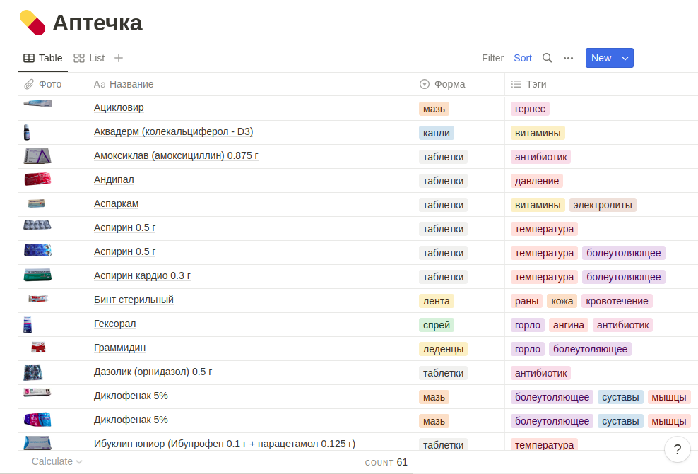

# Telegram bot for search the medicine in my home first aid kit
> https://t.me/mserg_apteka_bot

I developed this project while I had COVID and I was doing an inventory of my home first-aid kit.

## How it works
The bot listens to users' requests and searches records via Notion API in the database. 
If something is found, a user gets the answer including a photo of the medicine and tags, and location info.

The data updates from the database periodically or by the command `/update`.

The database easily administrates at the Notion service.

## Configuration file
Option `-c` sets the configuration file path (default `./conf.toml`).

```toml
[tg_api]
    token = '...'                                   # Tg bot token, BotFather (https://t.me/BotFather) helps

[notion_api]
    token = '...'                                   # notion account API token
    timeout = '10s'                                 # request timeout
    version = '2021-08-16'                          # API version
    db_id = '...'                                   # notion database ID
    search_url = 'https://api.notion.com/v1/search' # seach API URL

[warehouse]
    update_interval = '45m'                         # autoupdate data time interval
```
## Docker
```bash
docker build -t bot .
docker run -v ${PWD}/conf.toml:/conf.toml --rm -it bot:latest
```

## Build & run
```bash
go mod download
go test ./cmd/bot
go build -o bot ./cmd/bot
```

## Screencast
### DB in the Notion table


### Bot interaction

